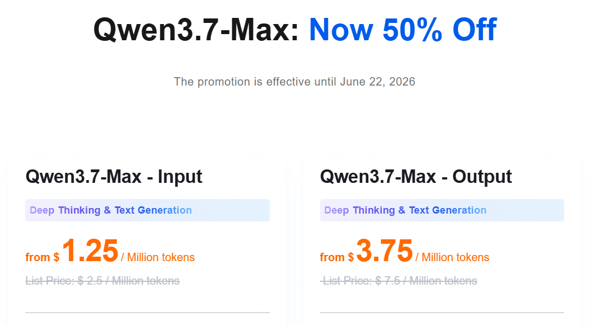

# Qwen Dev Tutor IT

> **Porta Qwen nella developer education italiana** — un MVP open-source, pratico e accessibile per workshop, community meetup e storytelling tecnico.



---

## Perché questo progetto conta

Molti progetti AI mostrano che un modello "può rispondere". Questo progetto mostra qualcosa di più interessante:

**come Qwen può essere presentato, insegnato e adottato in un contesto developer-first.**

Qwen non è un singolo modello — è una **famiglia di modelli AI** sviluppata dal team Qwen di Alibaba Cloud, con:

- **LLM general-purpose** per chat, ragionamento e scrittura
- **Modelli per coding** per spiegazione, generazione e revisione del codice
- **Modelli multimodali** (visione, audio) per interazioni più ricche
- **Versioni hosted via API** e **release open-source**

Qwen Dev Tutor IT è pensato per creare un **ponte** tra i modelli e le persone che vogliono usarli davvero — sviluppatori, educator, community builder e maker.

---

## Funzionalità

| Area | Descrizione |
|---|---|
| 💬 **Chat testuale** | Interazione in italiano con Qwen |
| 🧑‍💻 **Developer Tutor** | Incolla codice → spiegazione, miglioramenti, test unitario |
| 👁️ **Vision Analyzer** | Carica un'immagine → Qwen la descrive e analizza |
| 📊 **Model Comparison** | Confronta modelli Qwen side-by-side sullo stesso prompt |
| 🖥️ **CLI** | Comandi `chat`, `code-review`, `compare` |
| 🌐 **API** | FastAPI con endpoint `/chat`, `/tutor`, `/vision`, `/chat/stream` |
| 🎨 **Web UI** | Interfaccia ricca con streaming SSE, tema scuro, copia |
| 🔌 **Provider-agnostic** | Funziona con qualsiasi endpoint OpenAI-compatible |
| 🐳 **Docker** | Dockerfile + docker-compose pronti al deploy |

---

## Avvio rapido

### Prerequisiti

- Python 3.11+
- Un endpoint OpenAI-compatible (Alibaba Model Studio, Ollama, vLLM, LM Studio...)

### Installazione

```bash
# Clona il repository
git clone https://github.com/dcargnino/qwen-dev-tutor-it.git
cd qwen-dev-tutor-it

# Crea il venv e installa
uv venv --python 3.12
uv pip install -e ".[dev]"

# Configura il tuo endpoint
cp .env.example .env
# Modifica .env con la tua API key, base URL e modello
```

### Configurazione

Crea un file `.env`:

```env
QWEN_PROVIDER=alibaba-model-studio
QWEN_API_KEY=tua-api-key
QWEN_BASE_URL=https://dashscope-intl.aliyuncs.com/compatible-mode
QWEN_MODEL=qwen3.6-flash
QWEN_TIMEOUT_SECONDS=60
QWEN_ALLOW_EMPTY_API_KEY=false
```

Per setup locali (Ollama, vLLM, LM Studio):

```env
QWEN_PROVIDER=ollama-local
QWEN_API_KEY=local-demo-key
QWEN_BASE_URL=http://localhost:11434
QWEN_MODEL=qwen2.5-coder:7b
QWEN_ALLOW_EMPTY_API_KEY=true
```

---

## Utilizzo

### CLI

```bash
# Chat testuale
python -m qwen_dev_tutor chat "Spiegami FastAPI in italiano"

# Code review
python -m qwen_dev_tutor code-review examples/simple_function.py

# Confronto modelli
python -m qwen_dev_tutor compare "Cos'è FastAPI?" --models qwen3.6-flash,qwen3-coder-flash

# Confronto da file YAML
python -m qwen_dev_tutor compare "Spiega i decorator Python" --from-yaml config/models.example.yaml
```

### Server API

```bash
uvicorn qwen_dev_tutor.api:app --reload --host 0.0.0.0 --port 8000
```

| Endpoint | Metodo | Descrizione |
|---|---|---|
| `/health` | GET | Stato configurazione |
| `/chat` | POST | Chat testuale |
| `/chat/stream` | POST | Chat con streaming SSE |
| `/tutor` | POST | Analisi codice |
| `/vision` | POST | Analisi immagini (base64) |
| `/` | GET | Web UI |

### Docker

```bash
docker compose up -d
```

---

## Struttura del progetto

```
qwen-dev-tutor-it/
  README.md              # Documentazione (inglese)
  README.it.md           # Documentazione (italiano)
  README.zh-cn.md        # Documentazione (cinese)
  .env.example           # Template ambiente
  pyproject.toml         # Config progetto + dipendenze
  Makefile               # Target comuni (test, lint, run, docker)
  Dockerfile             # Build Docker multi-stage
  docker-compose.yml     # Deploy rapido
  config/
    models.example.yaml  # Configurazione multi-modello YAML
  exercises/
    01_text_chat.md      # Esercizio chat testuale
    02_code_explanation.md    # Esercizio spiegazione codice
    03_model_comparison.md    # Esercizio confronto modelli
    04_vision.md          # Esercizio analisi immagini
    05_audio.md           # Esercizio trascrizione audio
    06_agentic_workflow.md    # Esercizio workflow agentico
  src/qwen_dev_tutor/
    config.py            # Configurazione runtime
    client.py            # Client HTTP OpenAI-compatible
    prompts.py           # Prompt di sistema e costruzione messaggi
    tutor.py             # Logica di business (chat, tutor, vision)
    models.py            # Caricamento YAML multi-modello
    api.py               # Applicazione FastAPI + Web UI
    cli.py               # Punto d'ingresso CLI
  tests/
    test_config.py       # 13 test
    test_client.py       # 22 test
    test_prompts.py      # 4 test
    test_tutor.py        # 22 test
    test_cli.py          # 15 test
    test_api.py          # 22 test
    test_models.py       # 9 test
```

---

## Esercizi

La cartella `exercises/` contiene un percorso didattico completo:

1. **Text Chat** — interazione base con Qwen
2. **Code Explanation** — flusso developer tutor
3. **Model Comparison** — confronto tra modelli Qwen
4. **Vision Analyzer** — analisi multimodale di immagini
5. **Audio & Speech** — trascrizione e analisi (STT + Qwen)
6. **Agentic Workflow** — analisi repository e generazione issue

---

## Roadmap

```text
Oggi
  |-- Chat testuale in italiano
  |-- Developer tutor (codice → spiegazione + test)
  |-- Vision analyzer
  |-- CLI + API + Web UI
  |-- Confronto modelli
  |-- Docker + CI
  v
Domani
  |-- Streaming migliorato (tutor + vision SSE)
  |-- Metriche di benchmark
  |-- Toolkit per workshop
  |-- Materiale per sessioni community
```

---

## A chi è rivolto

- **Developer** che vogliono provare Qwen su task reali di codice
- **Educator e creatori di workshop** che cercano materiale hands-on
- **Community builder e Ambassador** che costruiscono attorno a Qwen
- **Maker e sperimentatori** che esplorano confronti tra modelli

---

## Sviluppo

```bash
# Esegui test
make test          # oppure: .venv/bin/python -m pytest tests/ -v

# Lint
make lint          # oppure: .venv/bin/ruff check src/qwen_dev_tutor/ tests/

# Formatta
make lint-fix

# Avvia in locale
make run
```

---

## Licenza

MIT — vedi il file [LICENSE](LICENSE) per i dettagli.
